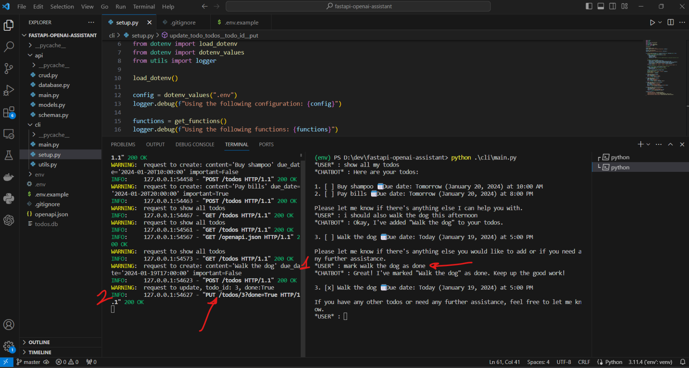

# Simple Smart Assistant
This project shows how to build a simple CLI assistant that uses a custom api to perform CRUD operations on a TODO SQL table. 

THe show is made as simple as possible, using the following main libraries:

- openai
- fastapi
- sqlalchemy

## Screenshots

